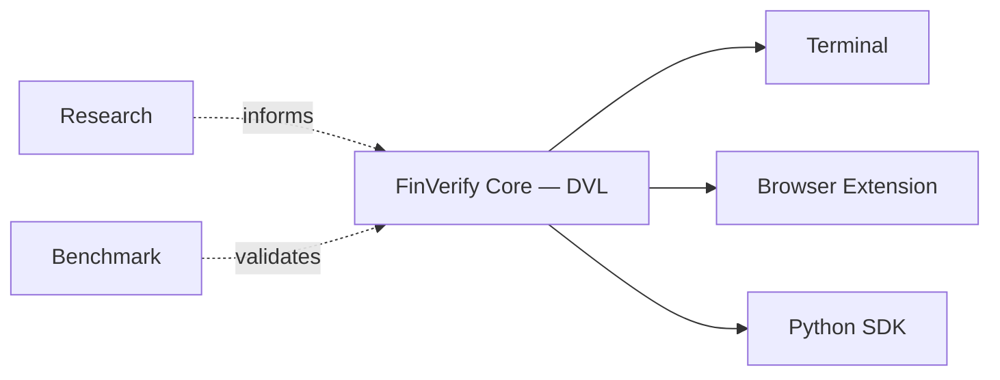

 

# FinVerify

### Verification infrastructure for financial intelligence.

Financial AI fails quietly — a misplaced decimal, a flipped sign, a percentage
reported as a raw fraction. FinVerify exists to catch what prompting can't:
a deterministic layer that checks every number an AI system produces before
anyone acts on it.

 

[**Website**](https://finverifyllm.lovable.app/) &nbsp;•&nbsp; [**Documentation**](https://github.com/FinVerify/Finverify) &nbsp;•&nbsp; [**Research**](https://github.com/FinVerify/Finverify/tree/main/research) &nbsp;•&nbsp; [**Discussions**](https://github.com/FinVerify/Finverify/discussions) &nbsp;•&nbsp; [**LinkedIn**](https://www.linkedin.com/company/finverify)

 

---

## Philosophy

FinVerify is not another financial LLM. It is the layer that sits between a
model's output and the decision a person makes because of it.

Most efforts to fix numerical hallucination reach for a bigger model or a
better prompt. That treats a mechanical problem as a reasoning problem. A
scale error, a sign flip, a unit mismatch — these are not failures of
judgment, they're failures of arithmetic, and arithmetic doesn't need to be
prompted. It needs to be checked.

FinVerify is built around three commitments:

| | |
|---|---|
| **Deterministic, not probabilistic** | Corrections come from rules, not another model's guess. The same input produces the same output, every time. |
| **Auditable, not opaque** | Every correction is logged — the rule that fired, the original value, the corrected value. Nothing is silently changed. |
| **Evidence-backed, not asserted** | Verification is ground-truth-free by design, so it holds up in production, not just in a benchmark with the answer key attached. |

This is infrastructure, in the same sense that a payments company treats
fraud detection as infrastructure — invisible when it works, and load-bearing
everywhere it's installed.

---

## Ecosystem

FinVerify ships as a small set of focused components that share a single
verification core. None of them work around the core — they all call into it.

| Product | What it's for |
|---|---|
| **FinVerify Core** | The Deterministic Verification Layer (DVL) — the rule engine every other surface calls into |
| **Terminal** | A terminal-style interface and market dashboard for querying and inspecting verified financial data |
| **Browser Extension** | Inline verification of AI-generated numbers, directly inside the chat UIs people already use |
| **Python SDK** | A typed client for teams who want DVL verification inside their own applications |
| **Benchmark** | An independent, ground-truth-blind evaluation harness for measuring verification quality |
| **Research** | The papers, ablations, and reproducibility assets behind the method |

Today, all of these live as directories inside one monorepo — see
[Platform Components](#platform-components) below for where each one is, and
its own README for setup and implementation detail.

---

## Architecture

Every product calls the same verification core — there is one place where
correction logic lives, not one implementation per surface. Benchmark exists
outside that core deliberately, so it can evaluate it without bias.

---

## Why FinVerify

| Traditional AI | Verification-first AI |
|---|---|
| The output is trusted by default | The output is checked before it's trusted |
| Errors are treated as a prompting problem | Errors are classified, then corrected by rule |
| Reasoning is opaque | Corrections are logged and reproducible |
| Confidence is implied | Confidence is scored, and shown |
| A bigger model is the fix | A better rule is the fix |

---

## Platform Components

FinVerify currently lives as a single monorepo — [`finverify-llm`](https://github.com/aadityat23/finverify-llm).
Each component below is a directory within it, not a separate repository.

| Component | Description | Path |
|---|---|---|
| Backend & Terminal | FastAPI verification service, terminal UI, and market dashboard | [`finverify-terminal`](https://github.com/aadityat23/finverify-llm/tree/main/finverify-terminal) |
| Browser Extension | Chrome extension for inline verification in AI chat UIs | [`finverify-extension`](https://github.com/aadityat23/finverify-llm/tree/main/finverify-extension) |
| Python SDK | Official Python client — `pip install finverify-sdk` | [`finverify-sdk`](https://github.com/aadityat23/finverify-llm/tree/main/finverify-sdk) |
| Benchmark | Benchmark suite and evaluation harness | [`finverify-bench`](https://github.com/aadityat23/finverify-llm/tree/main/finverify-bench) |
| Research | Papers, notebooks, and reproducibility assets | [`research`](https://github.com/aadityat23/finverify-llm/tree/main/research) |

---

## Getting Started

Where you start depends on what you're trying to do.

<table>
<tr><td width="25%" valign="top">

**Users**

Want verified numbers inside a chat AI you already use? Start with the
**Browser Extension** directory.

</td><td width="25%" valign="top">

**Developers**

Building a product that surfaces financial numbers? Start with the
**Python SDK** or the **Terminal** backend.

</td><td width="25%" valign="top">

**Researchers**

Studying numerical hallucination or evaluation methodology? Start with
**Benchmark** and **Research**.

</td><td width="25%" valign="top">

**Contributors**

Looking to help build FinVerify itself? Start with the
`CONTRIBUTING.md` at the root of the monorepo.

</td></tr>
</table>

---

## Community

| | |
|---|---|
| 🌐 **Website** | [finverify.dev](https://finverifyllm.lovable.app/) |
| 💼 **LinkedIn** | [FinVerify](https://www.linkedin.com/company/finverify) |
| 📄 **Documentation** | [`finverify-terminal` README](https://github.com/FinVerify/Finverify) |
| 🐛 **Issues** | [GitHub Issues](https://github.com/FinVerify/Finverify/issues) |
| 💬 **Discussions** | [GitHub Discussions](http://github.com/FinVerify/Finverify/discussions) |

FinVerify is created and maintained by [Aaditya Thokal](mailto:aaditya.thokal24@gmail.com),
Universal College of Engineering, Mumbai.

 

**Apache 2.0 · Actively developed · Open to contributors**

